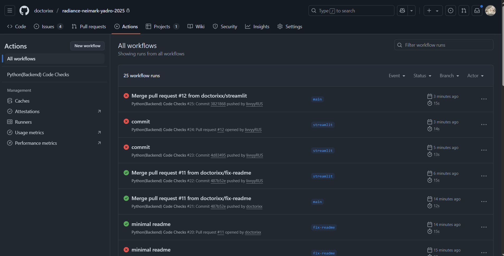
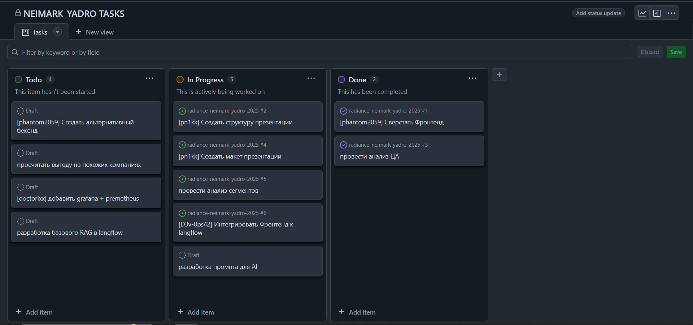

> Radiance team

# Работа с кодом

- Запрет на push в main (Security)
- CI для тестов кода (линтеры)

- Задачи организованы в Github Project (По методологии kanban)



# Запуск

## Grafana + Prometheus
- перейти в feedback service
- запустить
```shell
docker compose up --build
```
- добавить базу данных postgres
данные:

login: postgres

password: admin

host: host.docker.internal:25565

TLS/SSL Mode: disabled

- импортировать dashboard из `_monitoring/grafana_dashboard_export.json`

## Database

- перейти в feedback_service
- запустить
```shell
docker compose up --build
```
## Feedback microservice

- перейти в feedback service
- установить бибилиотеки
```shell
pip instal -r requirements
```
- запустить
```shell
python3 app.py
```
## Frontendback service
 - Перейти в директорию /streamlit
 - Создать виртуальное окружение venv
 - Установить зависимости
```shell
pip install requirements.txt
```
 - Добавить конфигурационный файл config.env со следующими данными
```
LANGFLOW_API_KEY=<<КЛЮЧ API LANGFLOW>>
YADRO_FLOW=<<Имя flow для RAG>>
CATEGORY_FLOW=<<Имя flow для Category>>
FEEDBACK_TOKEN=default-secret-token
```
 - Запустить проект
```shell
streamlit run main.py
```

## LangFlow
Для запуска RAG-хранилища:
 - Импортировать файл /langflow/Vector Store RAG.json
 - Добавить токены в места, где используется MistralAI
 - Добавить файлы из /langflow/files в RAG-хранилище в модуле File
 - Запустить модуль ChromaDB, через который данные загружаются

Для запуска агента по определению категорий запросов:
 - Импортировать файл /langflow/Category.json
 - Добавить токены в места, где используется MistralAI
